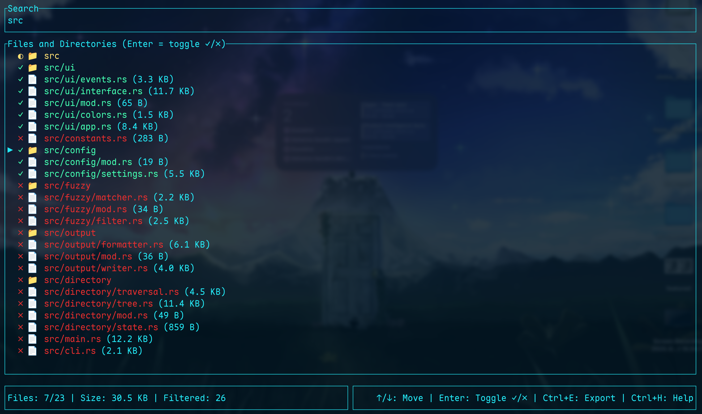

# gthr

A CLI tool for gathering text context of a directory, similar to [gitingest](https://gitingest.com/) web app, with a fuzzy finder for including/excluding files and several other configuration options.

<p align="center">
  
</p>

## Features

- **Smart Output**: Markdown output with syntax highlighting. Automatically copies to clipboard when you export. Optionally saves to a file.
- **Interactive Fuzzy Finder**: Browse and search through files with a responsive TUI
- **Hierarchical Selection**: Including/excluding directories affects all children
- **Color-coded Feedback**:
  - 🟢 Green: Included files/directories
  - 🔴 Red: Excluded files/directories
  - 🟡 Yellow: Partially included (mixed children states)
- **Two Modes**: Interactive mode with fuzzy finder or direct mode with pattern matching
- **Smart File Detection**: Automatically identifies text files vs binary files
- **Configurable**: Control file size limits, clipboard limits, gitignore behavior, and hidden file visibility
- **Two-Tier Configuration**: Global config (`~/.config/.gthr.toml`) with project-specific overrides (`.gthr.toml`)
- **Pattern Matching**: Supports glob patterns for include/exclude (e.g., `*.rs`, `**/*`)
- **Vim-like Controls**: Vim-like navigation (`Ctrl+J`/`Ctrl-K`) alongside arrow keys

## Installation

### Homebrew

```bash
brew install adarsh-roy/gthr/gthr
```

### Build From Source

**NOTE**: You must have `cargo` installed.

```bash
cargo install --git https://github.com/Adarsh-Roy/gthr --locked
```

## Usage

### Quick Start

```bash
# Interactive mode (default)
gthr

# Interactive mode with all files pre-included
gthr -I

# Direct mode - include only Rust files
gthr -i "*.rs" direct

# Show hidden files
gthr -H true

# Ignore .gitignore files
gthr -g false
```

For all available options, use:
```bash
gthr --help
```

### Interactive mode controls

**Search**
- Type any character - Adds to search
- `Backspace` - Delete search character
- `Esc` - Clear search (or quit if search is empty)

**Navigation**
- `↑/↓` or `←/→` - Move through files
- `Ctrl+J/Ctrl+K` - Vim-like navigation

**Selection**
- `Enter` - Toggle selection (✓/✗)

**Actions**
- `Ctrl+E` - Export and quit
- `Ctrl+H` - Show help
- `Esc` - Clear search or quit

### Output Behavior
- **Default**: Copies to clipboard (up to clipboard limit)
- **Large output**: Shows save dialog if total size exceeds clipboard limit
- **Manual save**: Use `-o filename.md` flag

## Configuration

gthr supports a two-tier configuration system with global defaults and per-project overrides.

### Configuration Files

1. **Global Config**: `~/.config/.gthr.toml` (applies to all projects)
2. **Project Config**: `.gthr.toml` in project root (overrides global)

### Configuration Priority

Settings are resolved in order (highest to lowest priority):
1. Command-line flags
2. Project configuration (`.gthr.toml`)
3. Global configuration (`~/.config/.gthr.toml`)
4. Built-in defaults

### Sample Configuration

```toml
# Maximum file size to include when traversing directories (in bytes)
# Default: 2097152 (2MB)
max_file_size = 2097152

# Maximum size for clipboard operations (in bytes)
# Default: 2097152 (2MB)
max_clipboard_size = 2097152

# Whether to respect .gitignore files by default
# Default: true
respect_gitignore = true

# Whether to show hidden files and directories (starting with .)
# Default: false
show_hidden = false
```

A complete sample is available in [`.gthr.toml`](./.gthr.toml).

## Command Line Options

```
Commands:
  interactive  Run the interactive fuzzy finder interface (default)
  direct       Generate text ingest directly without interaction

Options:
  -r, --root <ROOT>                Root directory [default: .]
  -I, --include-all                Pre-include all files
  -E, --exclude-all                Pre-exclude all files (default)
  -i, --include <PATTERN>          Include pattern (glob)
  -e, --exclude <PATTERN>          Exclude pattern (glob)
  -o, --output <OUTPUT>            Output file path
  -g, --respect-gitignore <BOOL>   Respect .gitignore [default: true]
  -H, --show-hidden <BOOL>         Show hidden files [default: false]
      --max-file-size <SIZE>       Max file size in bytes [default: 2097152]
  -h, --help                       Print help
  -V, --version                    Print version
```

## Examples

```bash
# Include everything, show hidden files, ignore .gitignore
gthr -I -H true -g false

# Direct mode - only Rust and TOML files
gthr -i "*.rs" -i "*.toml" direct

# Exclude build artifacts
gthr -I -e "target/*" -e "node_modules/*" direct

# Custom file size limit
gthr --max-file-size 5242880

# Save to file
gthr -o output.md
```

## Contributing

Contributions are welcome! Please submit issues, feature requests, or pull requests.

## License

This project is licensed under the MIT License - see the [LICENSE](./LICENSE) file for details.

## Similar Tools

- [gitingest](https://gitingest.com/) - Web-based repository ingestion
  - gthr adds interactive TUI with fuzzy matching
  - gthr supports clipboard output for quick pasting

## Roadmap

- [ ] Regex support in search bar
- [ ] Keyboard shortcuts for settings in interactive mode
- [ ] Performance optimizations for large directories
