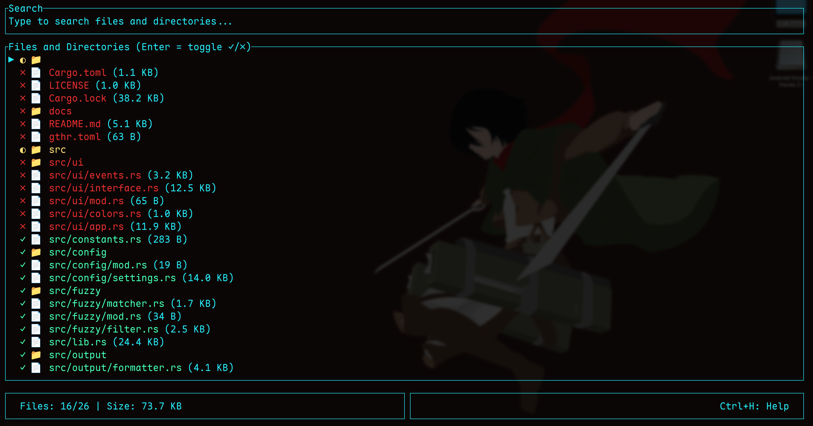

# gthr

Gathers text content from a directory tree into clipboard or file. Local alternative to [gitingest](https://gitingest.com/) with a fuzzy-finding TUI.

<p align="center">
  
</p>

## Installation

### Homebrew

```bash
brew install adarsh-roy/gthr/gthr
```

### Build from source

Requires `cargo`:

```bash
cargo install --git https://github.com/Adarsh-Roy/gthr --locked
```

## Usage

```bash
# Interactive mode (default) — all files start excluded
gthr

# Pre-include everything, then deselect what you don't need
gthr -I

# Direct mode — include only Rust files, output immediately
gthr -i "*.rs" direct

# Include specific paths (files or directories)
gthr -p src/lib.rs -p tests/ direct

# Save to file instead of clipboard
gthr -o output.md
```

### Modes

**Interactive** (default): Browse the file tree in a TUI, fuzzy-search, and toggle files before exporting.

**Direct** (`gthr direct`): Applies `-i`/`-e`/`-p` flags and outputs without opening the TUI.

### Interactive controls

| Action | Keys |
|---|---|
| Search | Type any character |
| Clear search / quit | `Esc` |
| Navigate | `↑`/`↓`, `Ctrl+J`/`Ctrl+K` |
| Half-page | `Ctrl+D`/`Ctrl+U` |
| Full-page | `Ctrl+F`/`Ctrl+B` |
| Jump to top/bottom | `Ctrl+T`/`Ctrl+G` |
| Toggle selection | `Enter` |
| Export and quit | `Ctrl+E` |
| Help | `Ctrl+H` |

### Output behavior

- Copies to clipboard by default (up to `max_clipboard_size`).
- If output exceeds the clipboard limit, prompts to save to a file.
- Use `-o <path>` to write directly to a file.

## CLI reference

```
Options:
  -r, --root <ROOT>                Root directory [default: .]
  -I, --include-all                Pre-include all files
  -i, --include <PATTERN>          Include glob pattern (repeatable)
  -e, --exclude <PATTERN>          Exclude glob pattern (repeatable)
  -p, --path <PATH>                Explicit file/directory paths (repeatable)
  -o, --output <PATH>              Write output to file
  -g, --respect-gitignore <BOOL>   Respect .gitignore [default: true]
  -H, --show-hidden <BOOL>         Show dotfiles [default: false]
      --max-file-size <BYTES>      Skip files larger than this [default: 2097152]
  -h, --help                       Print help
  -V, --version                    Print version

Commands:
  interactive  TUI fuzzy finder (default)
  direct       Output without interaction
```

## Configuration

A config file is auto-created at `~/.config/gthr.toml` on first run. Respects `XDG_CONFIG_HOME`.

**Priority** (highest wins): CLI flags > config file > built-in defaults.

### Config options

| Key | Default | Description |
|---|---|---|
| `max_file_size` | `2097152` (2 MB) | Skip files larger than this (bytes) |
| `max_clipboard_size` | `2097152` (2 MB) | Trigger file-save prompt above this size |
| `respect_gitignore` | `true` | Honor `.gitignore` rules during traversal |
| `show_hidden` | `false` | Include dotfiles and dot-directories |
| `extra_text_extensions` | `[]` | Extensions to always treat as text (e.g. `["mdx", "astro"]`) |
| `exclude_text_extensions` | `[]` | Extensions to never treat as text (e.g. `["min.js", "log"]`) |

### Text file detection overrides

gthr decides whether a file is "text" using ~60 hardcoded extensions plus content-based heuristics (UTF-8 check, null-byte detection). If a file isn't recognized or is wrongly classified, override it in config:

```toml
# Treat .prisma and .mdx as text
extra_text_extensions = ["prisma", "mdx"]

# Never treat .log or .min.js as text, even though they'd pass heuristics
exclude_text_extensions = ["log", "min.js"]
```

`exclude_text_extensions` takes priority. If an extension appears in both lists, it's excluded.

Extensions are case-insensitive and leading dots are stripped (`.RS`, `rs`, and `.rs` all match).

## Limitations

- **No regex in the TUI search bar** — fuzzy matching only. Glob patterns work in direct mode via `-i`/`-e`.
- **Binary files are excluded from output** — only files detected as text are included. Use `extra_text_extensions` if something is missed.
- **Clipboard may silently fail** — on headless systems or broken clipboard backends, output is lost. Use `-o` to be safe.
- **Large directories** — scanning happens in a background thread with streaming updates, but very large trees (100k+ files) will take time to fully load in interactive mode.
- **Config is global only** — no per-project config files. Use CLI flags for project-specific overrides.

## Examples

```bash
# Everything, including hidden files, ignoring .gitignore
gthr -I -H true -g false

# Only Rust and TOML files, direct output
gthr -i "*.rs" -i "*.toml" direct

# Exclude build artifacts
gthr -I -e "target/*" -e "node_modules/*" direct

# Include a specific file and a whole directory
gthr -p src/lib.rs -p tests/ direct

# Larger file size limit (5 MB)
gthr --max-file-size 5242880
```

## Contributing

Issues, feature requests, and pull requests are welcome.

## License

MIT — see [LICENSE](./LICENSE).

## Similar tools

- [gitingest](https://gitingest.com/) — web-based repository ingestion. gthr runs locally with a TUI and clipboard output.
